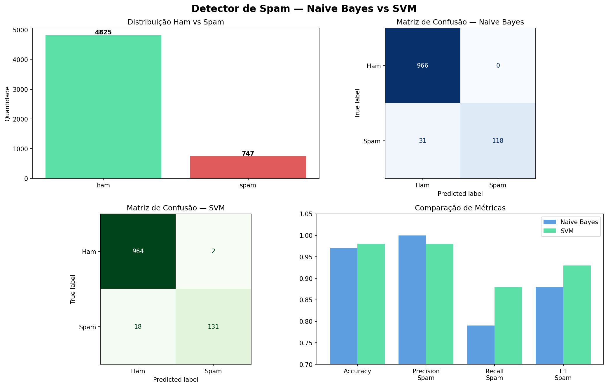

# 🚫 Detector de Spam — Naive Bayes vs SVM

Pipeline completo de NLP para classificar mensagens SMS como spam ou legítimas (ham), comparando dois modelos clássicos de Machine Learning com métricas detalhadas.

## Como foi feito

As mensagens foram transformadas em vetores numéricos com TF-IDF — técnica que identifica as 5000 palavras mais relevantes do corpus e pondera sua importância por frequência. Dois modelos foram treinados e comparados: Naive Bayes, clássico para NLP, e SVM linear, mais robusto para textos.

## Base de dados

Dataset real de SMS da UCI Machine Learning Repository com 5.572 mensagens:

| Label | Descrição | Quantidade |
|---|---|---|
| Ham | Mensagem legítima | 4.825 |
| Spam | Mensagem indesejada | 747 |

## Resultados

| Modelo | Accuracy | Precision Spam | Recall Spam | F1 Spam |
|---|---|---|---|---|
| Naive Bayes | 97% | 100% | 79% | 88% |
| SVM | 98% | 98% | 88% | 93% |

O SVM foi superior, especialmente no **recall do spam** — métrica mais crítica nesse problema, pois deixar spam passar é pior do que bloquear uma mensagem legítima.

## Pipeline NLP

1. Tokenização e remoção de stopwords
2. Vetorização TF-IDF com vocabulário de 5000 palavras
3. Split 80% treino / 20% teste com estratificação
4. Treinamento e avaliação dos dois modelos
5. Matriz de confusão e relatório de métricas

## Tecnologias

- Python 3
- pandas — manipulação dos dados
- scikit-learn — TF-IDF, Naive Bayes, SVM e métricas
- matplotlib — visualizações e matriz de confusão

## Como rodar

1. Clique no badge **Open in Colab** acima
2. Vá em `Runtime > Run all`
3. O dataset é carregado automaticamente via URL

## Resultado

